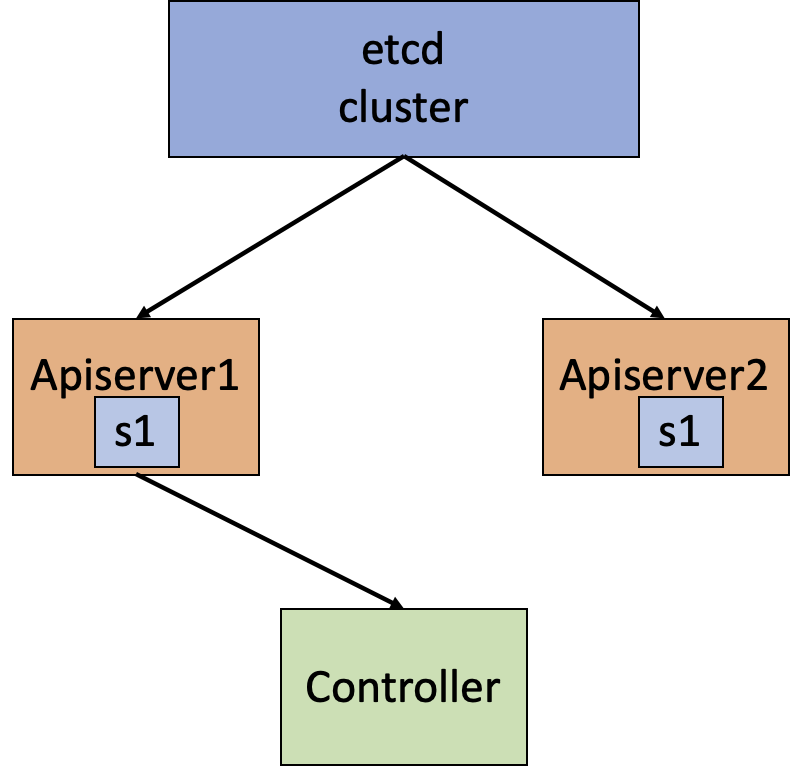
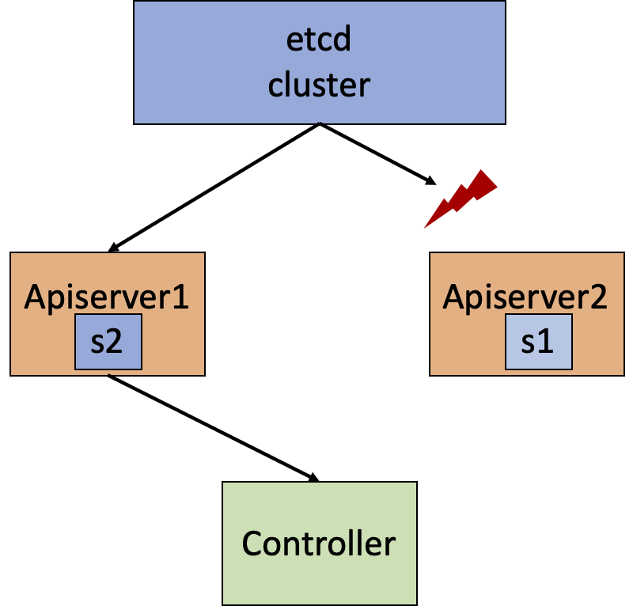
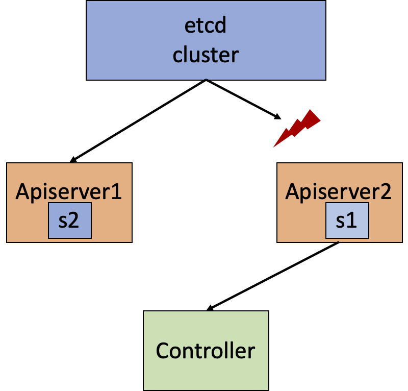

## Using Sonar to detect a time-travel bug in rabbitmq-operator

### What is Sonar?

Sonar is a bug detection tool for finding bugs in kubernetes controllers.
One of the bug patterns Sonar targets is time-travel bug, i.e., the bug caused by controller experiencing time traveling.

### What is a time-travel bug?

Time-travel bugs happen when the controller reads stale cluster status from a stale apiserver and behaves unexpectedly. Consider the following scenario:

In a HA kubernetes cluster, the controller is connecting to apiserver1. Initially each apiserver is updated with the current cluster status `S1`, and the controller performs reconciliation according to the state read from apiserver1.



Now some network disruption isolates apiserver2 from the underlying etcd, and apisever2 will not be able to get updated by etcd. Apisever1 is not affected, and its locally cached cluster status gets updated to `S2`.



The controller restarts after experiencing a node failure and connects to apiserver2. The isolated apiserver2 still holds the stale view `S1` though the actual status should be `S2`. The controller will read `S1` and perform reconciliation accordingly. The reconciliation triggered by reading `S1` again may lead to some unexpected behavior and cause failures like data loss or service unavailability.



### How does Sonar work (at a high level)?
To detect time-travel bugs, Sonar will create the above time travel scenario in a [kind](https://kind.sigs.k8s.io/) cluster to trigger the bug. In other words, Sonar perform failure testing by pausing the apiserver and restarting the controller at certain timing to make the controller experience a time traveling.

The following explains how Sonar detects a time-travel bug in [rabbitmq-operator](https://github.com/rabbitmq/cluster-operator).

### Prerequisite
#### Kind cluster is required
Sonar tests the controller in a kind cluster, so kind needs to be installed for testing.

#### controller needs to be recompiled
Some porting effort is required to use Sonar to test any controller.
We have already ported [rabbitmq-operator](https://github.com/rabbitmq/cluster-operator) (as in https://github.com/xlab-uiuc/sonar/tree/main/test-rabbitmq-operator) and rebuilt the images.

### Testing the controller with time travel config
Now, let's test the rabbitmq-operator
```
python3 run.py -p rabbitmq-operator -t test1 -c log/rabbitmq-operator/test1/learn/generated-config/time-travel-1.yaml
```
`test1` is the test workload (written by us) Sonar will run.
The workload simply does three things:
1. it creates a rabbitmq cluster `kubectl apply -f rmqc-1.yaml`
2. it deletes the rabbitmq cluster `kubectl delete RabbitmqCluster sonar-rabbitmq-cluster`
3. it recreates the rabbitmq cluster `kubectl apply -f rmqc-1.yaml`

`log/rabbitmq-operator/test1/learn/generated-config/time-travel-1.yaml` is the time-travel config which guides the failure testing (we will explain how the config works later).

By typing the command, Sonar will:
1. run a `test1` in the kind kubernetes cluster;
2. create the time-travel scenario during the test run according to `time-travel-1.yaml`.

When it finishes, you will see a bug is detected by Sonar that:
```
[CHECKING] side effect
[ERROR] statefulset/default/sonar-rabbitmq-cluster-server Create inconsistency: normal: 2, testing: 3
[ERROR] statefulset/default/sonar-rabbitmq-cluster-server Delete inconsistency: normal: 1, testing: 2
[BUG REPORT] # alarms: 2
[TIME TRAVEL DESC] Sonar makes the controller time travel back to the history to see the status just after rabbitmqcluster/default/sonar-rabbitmq-cluster: {"metadata": {"deletionTimestamp": "SONAR-NON-NIL", "deletionGracePeriodSeconds": 0}} (from kind-control-plane3)
[DEBUG SUGGESTION] Please check how controller reacts when seeing rabbitmqcluster/default/sonar-rabbitmq-cluster: {"metadata": {"deletionTimestamp": "SONAR-NON-NIL", "deletionGracePeriodSeconds": 0}}, the controller may issue deletion to statefulset/default/sonar-rabbitmq-cluster-server without proper checking
```
Sonar generates a bug report saying the controller issues more creation and deletion of `statefulset/default/sonar-rabbitmq-cluster-server` than normal, and suggest that this inconsistency is probably caused by controller issuing deletion without proper checking when seeing the non-nil `deletionTimestamp` of `rabbitmqcluster/default/sonar-rabbitmq-cluster`.

### Debugging with Sonar report
Sonar gives us a hint about the bug, but cannot automatically tell the root cause. Debugging still requires some manual efforts. Here is my experience:

I searched `deletionTimestamp` in the controller code to see how the controller reacts to it and I found:
```go
	// Check if the resource has been marked for deletion
	if !rabbitmqCluster.ObjectMeta.DeletionTimestamp.IsZero() {
		logger.Info("Deleting")
		return ctrl.Result{}, r.prepareForDeletion(ctx, rabbitmqCluster)
	}
```
The controller tries to delete the statefulset when seeing non-nil `deletionTimestamp` without checking the ownership of the statefulset.

Combining the `TIME TRAVEL DESC` and the `DEBUG SUGGESTION` from Sonar, the bug is identified:
After the rabbitmq cluster gets recreated by `test1`, Sonar makes the controller time travel back to see the non-nil `deletionTimestamp` (caused by the previous rabbitmq cluster deletion). Since the controller does not check statefuset ownership `prepareForDeletion`, it immediately deletes the currently running statefulset as a reaction of seeing the stale `deletionTimestamp`.

The detected bug is filed at https://github.com/rabbitmq/cluster-operator/issues/648 and has been fixed.

### What happened during the test?

Let's look into the generated time-travel config `log/rabbitmq-operator/test1/learn/generated-config/time-travel-1.yaml`:
```
project: rabbitmq-operator
mode: time-travel
straggler: kind-control-plane3
front-runner: kind-control-plane
operator-pod: rabbitmq-operator
command: /manager
timing: after
ce-name: sonar-rabbitmq-cluster
ce-namespace: default
ce-rtype: rabbitmqcluster
ce-diff-current: '{"metadata": {"deletionTimestamp": "SONAR-NON-NIL", "deletionGracePeriodSeconds": 0}}'
ce-diff-previous: '{}'
ce-etype-current: Updated
ce-etype-previous: Updated
se-name: sonar-rabbitmq-cluster-server
se-namespace: default
se-rtype: statefulset
se-etype: ADDED
description: 'Pause kind-control-plane3 after it processes a default/rabbitmqcluster/sonar-rabbitmq-cluster
  event E. E should match the pattern {"metadata": {"deletionTimestamp": "SONAR-NON-NIL",
  "deletionGracePeriodSeconds": 0}} and the events before E should match {}. And restart
  the controller rabbitmq-operator after kind-control-plane processes a ADDED default/statefulset/sonar-rabbitmq-cluster-server
  event.'
```
It looks a little bit complicated here. But don't worry. For now, you only need to understand a few fields here.

First,
```
straggler: kind-control-plane3
front-runner: kind-control-plane
```
means during testing we want to pause apiserver3 (which runs on `kind-control-plane3`) at **certain timing** to create the stale status.
And we use apiserver1 (which runs on `kind-control-plane`) as a referrence to restart the controller at **certain timing**.
The difficult part is how to decide the **timing** here.

Now let's look at
```
ce-name: sonar-rabbitmq-cluster
ce-namespace: default
ce-rtype: rabbitmqcluster
ce-diff-current: '{"metadata": {"deletionTimestamp": "SONAR-NON-NIL", "deletionGracePeriodSeconds": 0}}'
ce-diff-previous: '{}'
```
This is how Sonar decides when to pause the apiserver3. When Sonar sees an event belonging to `rabbitmqcluster/default/sonar-rabbitmq-cluster` and contains the sub-map in `ce-diff-current`, and a previous event contains the sub-map in `ce-diff-previous`,
Sonar will pause the apiserver3. Here, `ce-diff-current` basically means the event sets a `deletionTimestamp`, and `ce-diff-previous` does not pose any constraint since it is empty.

Finally, Sonar needs to decide when to restart the controller
```
se-name: sonar-rabbitmq-cluster-server
se-namespace: default
se-rtype: statefulset
se-etype: ADDED
```
When Sonar sees an `ADDED` event belonging to `statefulset/default/sonar-rabbitmq-cluster-server`, it will restart the controller and connect the controller to the paused apiserver3.

You will also find the explanation from the `description` field. By pausing apiserver3 and restarting controller at the timing above, the controller will behave incorrectly and the unexpected behavior (delete statefulset) gets captured by Sonar as a bug report.


### Finding the "harmful" status to trigger bugs
Sonar has a `learn` mode to infer the causality between events and side effects,
and Sonar then picks each potentially causal-related <crucial event, side effect> pair to guide the testing.

To do so, run:
```
python3 run.py -p rabbitmq-operator -t test1 -m learn
```
The command may take a few minutes to finish. It will run test workload `test1` in Sonar `learn` mode.
`test1` is a simple test workload written by us that creates, deletes and recreates the rabbitmq cluster.
After it finishes, you will see
```
Generated 1 time-travel config(s) in log/rabbitmq-operator/test1/learn/generated-config
```

The config contains many details about when to inject pause and node failure to make the controller go back to history.
We will look into the details later.
