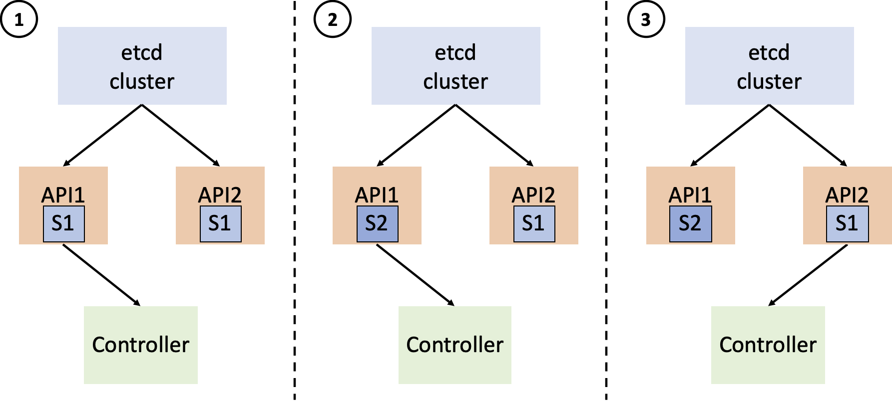

## Using Sieve to detect a stale-state bug in rabbitmq-operator

**Before trying the demo, please ensure your local environment meets all the [requirements](https://github.com/sieve-project/sieve#requirements) otherwise Sieve may not work.**

### What is Sieve?

Sieve is a testing tool for finding various bugs, including stale-state bugs, in kubernetes controllers.

### What is a stale-state bug?

Stale-state bugs refer to the bugs caused by a controller "going back in time" after restarts.
Stale-state bugs happen when the controller reads stale cluster state from a *stale* apiserver and behaves unexpectedly. Consider the following scenario:



1. In a HA kubernetes cluster, the controller is connected to apiserver1. Initially each apiserver is updated with the current cluster state `S1`, and the controller performs reconciliation according to the state read from apiserver1.

2. Now apiserver1's locally cached state gets updated by etcd to `S2`, while apiserver2's does not get updated in time and still holds the stale state `S1` (due to various reasons like apiserver2 being slow, experiencing a network disruption or temporary resource contention).

3. The controller restarts after experiencing a node failure and connects to apiserver2. The controller reads stale `S1` and performs reconciliation accordingly. The reconciliation triggered by reading `S1` again may lead to some unexpected behavior and cause failures like data loss or service unavailability.


We will use [a stale-state bug](https://github.com/rabbitmq/cluster-operator/issues/648) in [rabbitmq-operator](https://github.com/rabbitmq/cluster-operator) found by Sieve to show the end-to-end experience of testing the controller using Sieve.
In general, Sieve performs failure testing by pausing the apiserver and restarting the controller at certain timing to make the controller experience time travel.

### Prerequisite
**Kind cluster is required**. Sieve tests the controller in a kind cluster.

**The controller needs to be recompiled**. Sieve needs to instrument the `controller_runtime` and `client_go` libraries and rebuild the controller image. The instrumentation is automatically done.

**Test workloads are required.** Sieve doesn't generate test workloads to run. Sieve can reuse any existing e2e test workload that doesn't perform cluster set up (Sieve will set up the cluster for testing). We also wrote some simple workloads for Sieve.

### Testing the controller using Sieve
Now, let's test the rabbitmq-operator.

First build Kubernetes kind image and the controller image:
```
python3 build.py -m test
python3 build.py -c rabbitmq-operator -m test -s 4f13b9a942ad34fece0171d2174aa0264b10e947
```
The above commands download Kubernetes and controller source code, instrument the source code and build the images.
For Kubernetes, we use the branch `v1.18.9`. For the controller, we use `-s` to specify the commit id. 

Then run the test
```
python3 sieve.py -c rabbitmq-operator -m test -w recreate -p bug_reproduction_test_plans/rabbitmq-operator-stale-state-1.yaml
```
`-c rabbitmq-operator` specifies the controller that Sieve will test. We have already done some porting effort before testing rabbitmq-operator so Sieve can accept this option.

`-w recreate` is the test workload (written by us) that Sieve will run.
The workload simply does three things:
1. it creates a rabbitmq cluster
2. it deletes the rabbitmq cluster
3. it recreates the rabbitmq cluster

`-p bug_reproduction_test_plans/rabbitmq-operator-stale-state-1.yaml` is a test plan file that guides the failure testing. Triggering a stale-state bug requires lagging apiservers/restarting controllers with particular timing. The stale-state test plan encodes the particular timing so no manual intervention is required during testing.

By typing the above command, Sieve will:
1. run the `recreate` workload against the kind kubernetes cluster;
2. create the stale-state scenario during the test run according to the test plan file, `bug_reproduction_test_plans/rabbitmq-operator-stale-state-1.yaml`.

When it finishes, you will see the bug report generated by Sieve:
```
6 detected inconsistencies as follows
State-update summaries inconsistency: controllerrevision/default/rabbitmq-cluster-server-5f8b8665fb ADDED inconsistency: 2 event(s) seen during reference run, but 3 seen during testing run
State-update summaries inconsistency: controllerrevision/default/rabbitmq-cluster-server-5f8b8665fb DELETED inconsistency: 1 event(s) seen during reference run, but 2 seen during testing run
State-update summaries inconsistency: pod/default/rabbitmq-cluster-server-0 ADDED inconsistency: 2 event(s) seen during reference run, but 3 seen during testing run
State-update summaries inconsistency: pod/default/rabbitmq-cluster-server-0 DELETED inconsistency: 1 event(s) seen during reference run, but 2 seen during testing run
State-update summaries inconsistency: statefulset/default/rabbitmq-cluster-server ADDED inconsistency: 2 event(s) seen during reference run, but 3 seen during testing run
State-update summaries inconsistency: statefulset/default/rabbitmq-cluster-server DELETED inconsistency: 1 event(s) seen during reference run, but 2 seen during testing run
[PERTURBATION DESCRIPTION]
Sieve pauses the API server kind-control-plane3 when the trigger expression trigger1 is satisfied, where
trigger1 is satisfied after the API server kind-control-plane3 receives the event:
update rabbitmqcluster/default/rabbitmq-cluster from
{"metadata": {}}
to
{"metadata": {"deletionGracePeriodSeconds": "SIEVE-NON-NIL", "deletionTimestamp": "SIEVE-NON-NIL"}}
with the 1st occurrence.
Sieve reconnects the controller rabbitmq-operator from API server kind-control-plane to API server kind-control-plane3 when the trigger expression trigger2 is satisfied, where
trigger2 is satisfied after the API server kind-control-plane receives the event:
create statefulset/default/rabbitmq-cluster-server with the 1st occurrence.
Sieve resumes the API server kind-control-plane3 when the trigger expression trigger3 is satisfied, where
trigger3 is satisfied by a 20-second timeout.
```
Sieve generates a bug report saying that the controller issues more `CREATE` and `DELETE` operations for the resource named `statefulset/default/rabbitmq-cluster-server` than normal. It suggests that this inconsistency is probably caused by the controller issuing deletions without proper checking when seeing the non-nil `deletionTimestamp` of the resource named `rabbitmqcluster/default/rabbitmq-cluster`.

### Debugging with Sieve report
Sieve gives us a hint about the bug, but cannot automatically tell us the root cause. Debugging still requires some manual effort. Here is my experience:

I searched for `deletionTimestamp` in the controller code to see how the controller reacts to it and I found:
```go
	// Check if the resource has been marked for deletion
	if !rabbitmqCluster.ObjectMeta.DeletionTimestamp.IsZero() {
		logger.Info("Deleting")
		return ctrl.Result{}, r.prepareForDeletion(ctx, rabbitmqCluster)
	}
```
The controller immediately deletes the statefulset when seeing non-nil `deletionTimestamp` without checking the ownership of the statefulset in `prepareForDeletion`.

Combining the `DESCRIPTION` and the `DEBUGGING SUGGESTION` from Sieve, the bug is identified:
After the rabbitmq cluster gets recreated, Sieve makes the controller time travel back to see the non-nil `deletionTimestamp` (caused by the previous rabbitmq cluster deletion). Since the controller does not check statefuset ownership in `prepareForDeletion`, it immediately deletes the currently running statefulset as a reaction of seeing the stale `deletionTimestamp`.

The detected bug is filed at https://github.com/rabbitmq/cluster-operator/issues/648 and has been fixed.

### How does Sieve find bugs?
To detect stale-state bugs, Sieve runs in two phases to force the controller to experience time travel by injecting apiserver pause and controller restart.

The first phase is called *learning phase* where Sieve runs the test workload (without any injection) and records the events triggering controller reconciliation and side effects (resource creation/deletion/update) invoked by the controller. Sieve analyzes the controller trace and generates the stale-state test plan to guide the following testing phase. Sieve also records the cluster status and controller behavior as part of the testing oracle.

The second phase is called *testing phase* where Sieve runs the test workload and injects apiserver pause and controller restart at certain timing according to the stale-state test plan. Sieve compares the cluster status and controller behavior in the testing run and the learning run, and generates a bug report if any inconsistency is detected.


### What is in the stale-state test plan?

Recall that we need to pause the apiserver and restart the controller with **a certain timing**. The time travel configuration file specifies the required timing for pausing the apiservers or restarting the controller.

Let's look into the generated test plan `bug_reproduction_test_plans/rabbitmq-operator-stale-state-1.yaml`:
```
actions:
- actionType: pauseAPIServer
  apiServerName: kind-control-plane3
  pauseScope: rabbitmqcluster/default/rabbitmq-cluster
  trigger:
    definitions:
    - triggerName: trigger1
      condition:
        conditionType: onObjectUpdate
        resourceKey: rabbitmqcluster/default/rabbitmq-cluster
        prevStateDiff: '{"metadata": {}}'
        curStateDiff: '{"metadata": {"deletionGracePeriodSeconds": "SIEVE-NON-NIL",
          "deletionTimestamp": "SIEVE-NON-NIL"}}'
        occurrence: 1
      observationPoint:
        when: afterAPIServerRecv
        by: kind-control-plane3
    expression: trigger1
- actionType: reconnectController
  controllerLabel: rabbitmq-operator
  reconnectAPIServer: kind-control-plane3
  async: true
  waitBefore: 10
  trigger:
    definitions:
    - triggerName: trigger2
      condition:
        conditionType: onObjectCreate
        resourceKey: statefulset/default/rabbitmq-cluster-server
        occurrence: 1
      observationPoint:
        when: afterAPIServerRecv
        by: kind-control-plane
    expression: trigger2
- actionType: resumeAPIServer
  apiServerName: kind-control-plane3
  pauseScope: rabbitmqcluster/default/rabbitmq-cluster
  trigger:
    definitions:
    - triggerName: trigger3
      condition:
        conditionType: onTimeout
        timeoutValue: 20
    expression: trigger3
```
It looks quite complicated. But don't worry. For now, you only need to understand a few fields here.

First,
```
- actionType: pauseAPIServer
  apiServerName: kind-control-plane3
  ...
  trigger:
    definitions:
    - triggerName: trigger1
      condition:
        conditionType: onObjectUpdate
        resourceKey: rabbitmqcluster/default/rabbitmq-cluster
        prevStateDiff: '{"metadata": {}}'
        curStateDiff: '{"metadata": {"deletionGracePeriodSeconds": "SIEVE-NON-NIL",
          "deletionTimestamp": "SIEVE-NON-NIL"}}'
        occurrence: 1
      ...
    expression: trigger1
```
means Sieve will pause API server 3 (i.e., `kind-control-plane3`) when `rabbitmqcluster/default/rabbitmq-cluster` is updated with a non-nil `deletionTimestamp`.

Next,
```
- actionType: reconnectController
  controllerLabel: rabbitmq-operator
  reconnectAPIServer: kind-control-plane3
  ...
  trigger:
    definitions:
    - triggerName: trigger2
      condition:
        conditionType: onObjectCreate
        resourceKey: statefulset/default/rabbitmq-cluster-server
        occurrence: 1
      ...
    expression: trigger2
```
means Sieve will reconnect the controller to the paused API server 3 (by restarting it) when `statefulset/default/rabbitmq-cluster-server` is created.

Finally,
```
- actionType: resumeAPIServer
  apiServerName: kind-control-plane3
  ...
  trigger:
    definitions:
    - triggerName: trigger3
      condition:
        conditionType: onTimeout
        timeoutValue: 20
    expression: trigger3
```
means Sieve will resume API server 3 after a 20-second timeout.


### How is the stale-state test plan generated?
The test plan is generated by analyzing the controller's trace during a reference run.

To run the reference run and generate the test plan,
```
python3 sieve.py -c rabbitmq-operator -w recreate -m learn --build-oracle
```
The command will run the test workload `recreate`, collect the controller's trace and generate the stale-state test plan.

After it finishes, you will see
```
Generated 1 stale-state test plan(s) in sieve_learn_results/rabbitmq-operator/recreate/learn/stale-state
```

The generated test plan is exactly the same as used in test.
